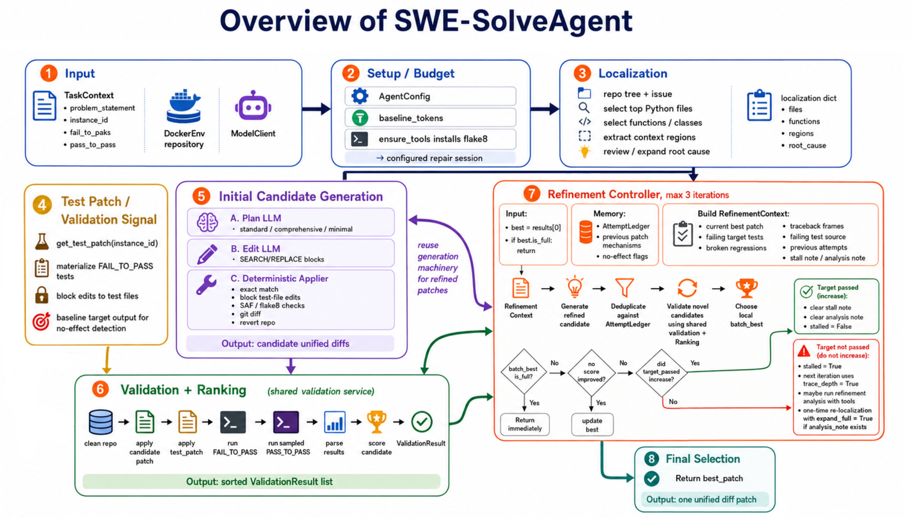

# SWE-SolveAgent

**A multi-phase LLM agent that repairs real GitHub issues on [SWE-bench](https://www.swebench.com/).**

Given a bug report and a repository inside a Docker sandbox, the agent returns a **unified diff patch**. The core entrypoint is `solve_task` in [`src/agent.py`](src/agent.py):

```text
issue + repo @ /testbed
        │
        ▼
   localize  →  generate  →  validate  →  refine  →  best patch
```

Inspired by [PatchPilot](https://arxiv.org/abs/2502.02747) / Agentless-style rule-based workflows (fixed phase order instead of an open-ended agent loop).



---

## Highlights

| Phase | What it does |
|--------|----------------|
| **Localize** | Hierarchical fault localization: files → functions/lines |
| **Generate** | Plan-then-generate multiple candidate patches (SEARCH/REPLACE → git diff) |
| **Validate** | Deterministic Docker test runs + ranking (no LLM cost) |
| **Refine** | Iterate on failing tests under a token budget; return best-so-far |

- Runs against official **SWE-bench Docker** environments
- Model-agnostic API client (default: DeepSeek via OpenAI-compatible endpoint)
- Token-budget guard for cost control during multi-phase repair

### Efficiency (sample run)

On a **5-task** SWE-bench Lite subset (`deepseek-v3.2`, final pipeline):

| Metric | Value |
|--------|------:|
| Prompt tokens | 363,485 |
| Completion tokens | 61,087 |
| **Total tokens** | **424,572** |
| **≈ per task** | **~84.9k** |

Validation/ranking is deterministic (Docker tests only), so ranking cost does not consume LLM tokens. Treat these figures as a cost profile for that run size, not a full-benchmark score.

---

## Architecture

Implementation lives under `src/`. The public contract is a single function:

```python
def solve_task(context: TaskContext, env: DockerEnv, model: ModelClient) -> str:
    """Pipeline: localize → generate → validate → refine → select best patch."""
    ...
    return best_patch  # unified diff string
```

| Module | Role |
|--------|------|
| `src/agent.py` | `solve_task` orchestration |
| `src/localize.py` | Hierarchical localization |
| `src/generate.py` | Plan + candidate generation |
| `src/validate.py` | Test execution & ranking |
| `src/refine.py` | Refinement loop |
| `src/config.py` | `AgentConfig` (candidates, budget, validation mode) |
| `utils/*` | Framework: Docker env, model client, I/O, task loading |

```text
.
├── main.py              # CLI: generate predictions.jsonl
├── evaluate.py          # CLI: official SWE-bench harness evaluation
├── src/                 # ★ SWE-SolveAgent (solve_task pipeline)
├── utils/               # Docker / model / patch helpers
├── scripts/             # dataset download & image pull
├── tests/               # unit tests for agent phases
├── assets/
│   └── pipeline.jpg     # architecture diagram
├── requirements.txt
├── swebench_tasks.txt   # instance_id list
└── .env.example
```

---

## Quick start

### 1. Install

```bash
python3 -m venv .venv
source .venv/bin/activate
pip install -r requirements.txt
```

### 2. Configure model

Copy `.env.example` → `.env` and set your API credentials:

```env
apikey=your-api-key
base=https://api.example.com/v1
model=deepseek-v3.2
```

### 3. Prepare tasks & data

`swebench_tasks.txt` — one `instance_id` per line:

```text
# one instance per line
astropy__astropy-12907
django__django-11099
```

```bash
# Download SWE-bench Lite locally
python scripts/download_dataset.py \
  --dataset princeton-nlp/SWE-bench_Lite \
  --output-dir data/princeton-nlp__SWE-bench_Lite

# Pull Docker images for the listed tasks (large; start with a few)
python -m scripts.pull_images --tasks swebench_tasks.txt
```

### 4. Generate predictions

```bash
python main.py \
  --tasks swebench_tasks.txt \
  --dataset princeton-nlp/SWE-bench_Lite \
  --split test \
  --output predictions.jsonl \
  --run-id demo
```

### 5. Evaluate

```bash
python evaluate.py \
  --predictions predictions.jsonl \
  --dataset princeton-nlp/SWE-bench_Lite \
  --split test \
  --run-id demo \
  --max-workers 1
```

---

## Core API

```python
from src.agent import solve_task

patch: str = solve_task(context, env, model)
# patch is a unified diff written as model_patch in predictions.jsonl
```

Each prediction line:

```json
{"instance_id": "...", "model_name_or_path": "...", "model_patch": "diff --git ..."}
```

---

## Tech stack

- **Python 3.10+**
- **SWE-bench** harness + Docker sandboxes
- **LLM** via OpenAI-compatible HTTP API
- **pytest** for unit tests

---

## References

- [SWE-bench](https://www.swebench.com/) — real GitHub issue repair benchmark
- [SWE-bench harness docs](https://www.swebench.com/SWE-bench/reference/harness/)
- PatchPilot / Agentless-style multi-phase repair agents (localize → generate → validate → refine)

---

## License

Course / portfolio project. SWE-bench is third-party software; use their license for the benchmark harness.
